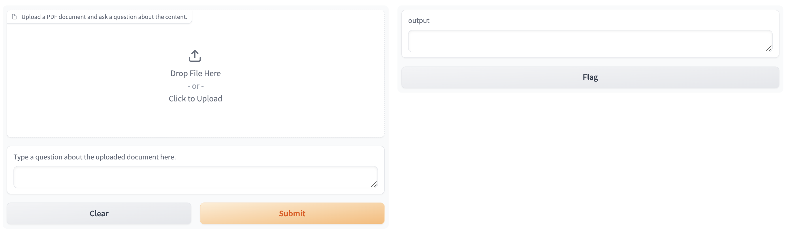
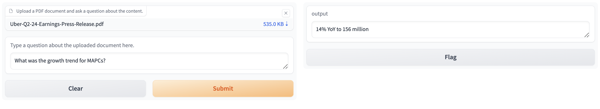

# question-answer-ai
A simple Q&A app built using a pre-trained LLM (via HuggingFace) that answers questions about a PDF document. The application can be run locally and safely used with internal documents. The example PDF is Uber's financial results from Q2 2024, with the perspective that this question answering system could be used when reviewing company financial data.

This area in Natural Language Processing (NLP) is useful for finance professionals (and professionals in other fields) in producing user-friendly content for other users like reports.

Before a file is loaded, the application looks like this in the browser window:



When a file has been uploaded and a question has been asked, this is what the response looks like in the application:



## Project Structure
Aside from the requirements.txt file which details the required packages for the environment, the application resides in the notebook.ipynb file.

## Future enhancements
For simplicity, the PDF is available directly at the same level as the application code. To add complexity, a pipeline could be developed which checks for the when the information is published and scrapes the financial results (or the content of the PDF), then loads this data for preprocessing. The processed results could then be fed into a trained transformer model, which may produced more accurate responses to answers.

## How to run:
1. Install virtualenv:
```
$ pip install virtualenv
```

2. Open a terminal in the project root directory and run:
```
$ virtualenv env
```

3. Then run the command to activate the virtual environment:

Windows
```
$ .\env\Scripts\activate
```

MacOS/Unix
```
$ source env/bin/activate
```

1. Install the dependencies:
```
$ (venv) pip install -r requirements.txt
```

1. Open up the Jupyter notebook (notebook.ipynb) and run each cell.
2. Navigate to http://127.0.0.1:7860 in a browser window to use the application outside of the Jupyter notebook.